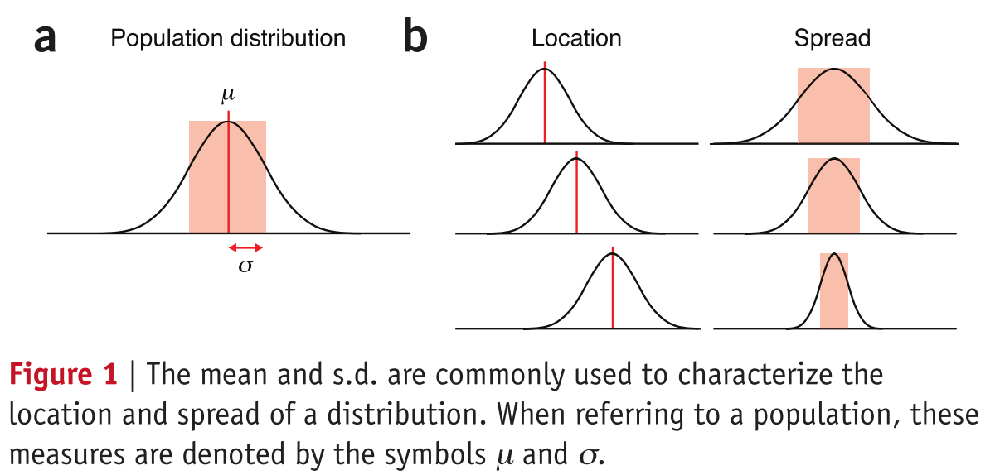

# [Importance of being uncertain](https://www.nature.com/articles/nmeth.2613)

>**统计并不会告诉我们我们是不是对的，而是告诉我们我们错误的可能性有多大。**

是不是很熟悉? _p value_ 啊。

>每当我们做一个重复实验的时候，我们不太可能重复出来**完全一样**的结果。由于生物的变化以及测量精度的限制，重复的实验将会测量目标值的范围。但是如果每次的测量值都不同，我们如何能说明，这个实验符合我们的假设，能够证明我们的假设理论没有问题？

>“科学的最大的悲剧就是，最美丽的假设理论都是被最丑陋的数据所屠戮。”而且这“丑陋”居然还没有办法测量。

科学版的“美女与野兽”。而且当别人问野兽有多丑时，我们只能回答，“有点丑”或者“非常丑”。

>然而统计却能帮助我们回答这个问题。它能帮助我们对实验中观察到的某一现象（数据）进行定量的可能性评估。同时还告诉我们数据并不是准确的测量，还是伴有一定错误的估计。丫还能告诉我们计算过程中的错误是如何从输入数据中传递进来的。这要理论框架，能够描述实验结果的不确定性，同时也能对我们从观察数据中得到的一般规律给出一个置信度的描述。

>尽管统计中的很多基本原理可以被很直观的理解，但在真实情况下，特别是涉及到“可能”及“概率”的时候，我们需要摒弃我们的直觉印象。

`Although many fundamental concepts in statistics can be understood intuitively, as natural pattern-seekers we must recognize the limits of our intuition when thinking about chance and probability.`我觉得这一部分我必须贴上原文，因为感觉上怎么翻译都是怪怪的。

>`Monty Hall`问题就是一个非常经典的例子，我们是如何既快又确信的得出一个错误的答案。

后面就主要是描述这个`Monty Hall`场景的。

>规则规定，一个参赛者需要从三个门中作出选择，选择对的门，可以获得一个奖励。当参赛者选择一扇门后（假设A门），主持人会打开另外两扇门中没有奖励的门（假设B门，如果剩下两扇门都没有奖励，就随便开一扇），然后给予参赛者第二次选择的机会，可以让参赛者重新选择没开又没有被选择的门（门C）。令人恼火的事情就是，作为参赛者，到底是应该换门C还是坚持自己选择门A。

为了方便大家理解，我从网上找了维基百科上对于这个游戏规则的描述：这个游戏的玩法是：参赛者会看见三扇关闭了的门，其中一扇的后面有一辆汽车或者是奖品，选中后面有车的那扇门就可以赢得该汽车或奖品，而另外两扇门后面则各藏有一只山羊或者是后面没有任何东西。当参赛者选定了一扇门，但未去开启它的时候，知道门后情形的节目主持人会开启剩下两扇门的其中一扇，露出其中一只山羊。主持人其后会问参赛者要不要换另一扇仍然关上的门。问题是：换另一扇门会否增加参赛者赢得汽车的机会率？

>答案是，选择换。but you would be in good company if you thought otherwise.

上面的英文的确不知道该怎么翻译，咨询了两位[@Nana7926](https://github.com/Nana7926)和[@Susuqu](https://github.com/Susuqu)，分别给出了下列两种供参考

- “但是如果你不这么想的话 你会在一个好公司” from [@Nana7926](https://github.com/Nana7926)
- “但如果你不这样想，你会有好的公司” from [@Susuqu](https://github.com/Susuqu)

最初我的想法也是其实没有什么差别，换与不换没有差别的。

>当这个答案发布在《Parada》杂志的时候，数以千计的读者（很多都是博士）反馈这个答案是错误的。评论千奇百怪，从“你错了，但是从积极的一面看，如果这些博士都是错的，那国家岂不是要陷入一些大的麻烦了” 到 “我必须承认我质疑你，除非我五年级的数学课能证明你是对的”

这一段其实完完全全是按照原文翻译，可是读起来总觉得太奇怪了，这说的是什么啊。暂时先这样写着，具体部分后续在慢慢斟酌。

>`The Points of Significance`系列就是让你工作中的与基础统计相关的理解能不被最初“感觉”出来的理解所左右。目的也很明确，就是处理“几乎半数医学杂志上发表的论文在用到统计方法的时候都是错误的”这样的状况。我们会以实际且令人信服的方式来进行介绍。我们主要聚焦在基础概念，实际技巧及常见的错误。

>每篇介绍都会有一个excel表格来展示计算式，主要展现数据及结果，不会用公式来迷惑大家。

这点非常的棒，过去课本中的统计大部分都是以公式及少量数据说明，一般很难了解到过程。正好有excel的支持，可以很清晰的看出结果随着数据的变化而产生的变化。

>统计可以大致分为两类：描述和推断。

描述现在所有数据的特性，推断新的数据可能的特性。

>第一个（描述）通过一些测量，例如`均值`、`标准差`来概括数据集的主要特征。第二个（推断）则是通过观察数据推断更大数据集的特性。而支撑他们的理论就是抽样及估计，抽样就是收集数据，而估计就是量化推断出的结果的不确定性。

>为了探讨`抽样`，我们需要首先介绍一个`总体`的概念，`总体`表示我们做推断的事物的集合。`群体`中的某一个实验变量的所有可能值的频率柱状图就是`总体分布`，如[^chap1-1]中的a图。我们也一贯的对于推断总体的`均值`和`标准差`感兴趣。`均值`和`标准差`分表描述了`总体`的位置还有展开的宽度，如[^chap1-1]中的b图。

>`均值`就是计算所有值的`算术平均数`，当有`极值`时，会产生错误的推断。相比之下`中值`就是对于位置描述更为鲁棒的一个概念。特别是对于一些`偏分布`及其他不规则的形状，`中值`更加合适。

>`标准差`计算是根据每个值距离`均值`的距离的平方进行计算的。有的时候可以用`方差`（`标准差`的平方），因为他的特性更容易用数学公式来表示。

>`标准差`并不是一个直觉的测量值，

The s.d. is not an intuitive measure, and rules of thumb help us in its interpretation. For example, for a normal distribution, 39%, 68%, 95% and 99.7% of values fall within ± 0.5
s , ± 1 , ± 2 and ± 3 . These s s s
cutoffs do not apply to populations that are not approximately normal, whose
